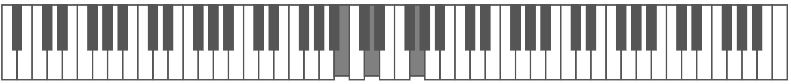

# Piano Keys Webcomponent



## Overview
Piano Keys is a webcomponent that renders a piano keyboard layout. It supports any number of keys and any layout. 
It provides methods to programatically trigger note up/down effects as well as callbacks for when users click on a note. 
The keyboard is rendered as SVG so should scale to work well at any size.
The component creates content using Shadow DOM so there should be no namespacing issues 
You can also customize the look and feel using CSS variables.

## Examples
[Examples](https://crswty.github.io/piano-keys-webcomponent/) with code samples 

## Configuration Options

The component supports the following HTML attributes

| Attribute        | Default   | Description
| ---------------- | --------- | -----------
| key-count        | 88        | Number of keys to render.
| keyboard-layout  | A         | Note to start rendering from 
| read-only        | off       | Set attribute to disable clicking on notes

## Methods
These methods are available after to call programmatically, i.e.
```javascript
document.getElementById("piano").setNoteDown("C", 4);
```

### setNoteDown
Sets the state of the note to pressed or not
```typescript
setNoteDown(note: string, octave: number)
```

### setNoteUp
Sets the state of the note to not be pressed
```typescript
setNoteUp(note: string, octave: number)
```

## Styling


| Attribute                  | Description
| -------------------------- | -----------
| natural-key-color          | Fill color of the natural keys
| natural-key-outline-color  | Border color of the natural keys
| sharp-key-color            | Fill color of the sharp keys
| sharp-key-outline-color    | Border color of the sharp keys
| depressed-key-color        | Color of keys when they are pressed
| depressed-key-transform    | Transformation to run when key is pressed
